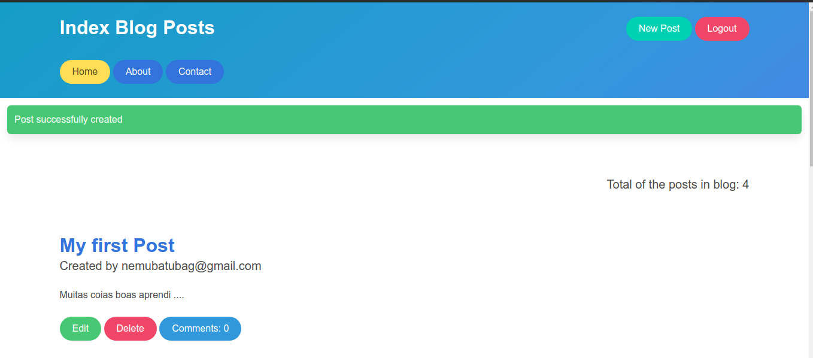

# Demo Blog

Foi desenvolvido um Blog simples e objetivo. O intuito desse projeto foi estudar o framework CSS Bulma e melhorar o conhecimento do framework Ruby on Rails, pois sabemos só aprendemos através da prática. 

Ferramentas (Gems) utilizadas:

* Ruby on Rails

* Sqlite3

* Bulma (Framework CSS)

* Devise

Bons Estudos !

Desenvolvido por: Alef O. de  Oliveira.

